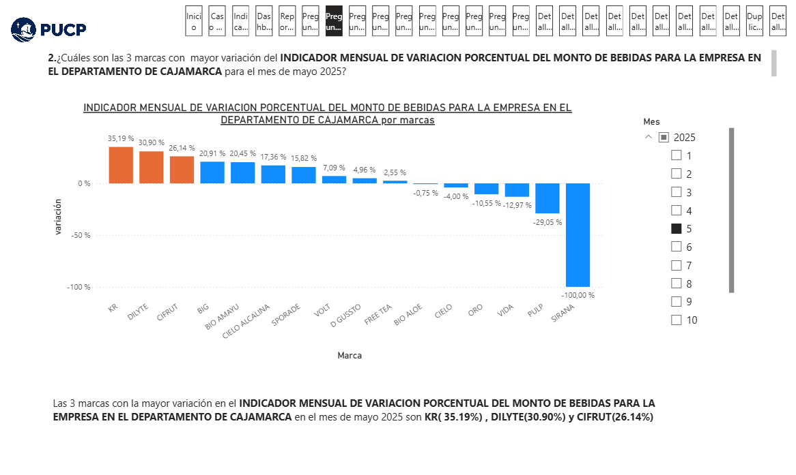

# 📊 DIPLOMADO BI GRUPO 2

## URL

https://app.powerbi.com/view?r=eyJrIjoiN2UxNmM0MTQtZWUyMS00MWU0LWI2MDctZTYwNmNhMWYyODIyIiwidCI6ImQ0YzI3ZTJkLWNkNzAtNDg3MS1iODZiLWVjNmMyOWQ0YjMzYSIsImMiOjR9

## Este es nuestro Script de creacion de tablas de la base de datos en SQL

[Script de creacion de tablas](CreacionTablas/ScripCreacion.txt)

## Este es nuestro Script de iNSERCCION de tablas de la base de datos en SQL

[Script de INSERCCION de tablas](InserccionDatos/InserccionDatos.txt)

## Este es nuestro diagrama de base de datos en SQL

## Este es mi reporte

Este proyecto forma parte del diplomado en Business Intelligence. A continuación se muestra una vista del reporte principal realizado en Power BI.

### Pregunta 1

### Pregunta 2

### Pregunta 3

### Pregunta 4

### Pregunta 5

### Pregunta 6

### Pregunta 7

### Pregunta 8

### Pregunta 9

### Pregunta 10

